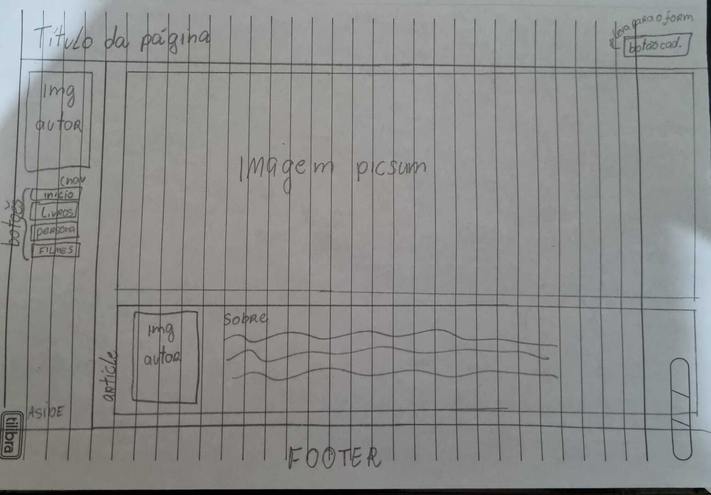
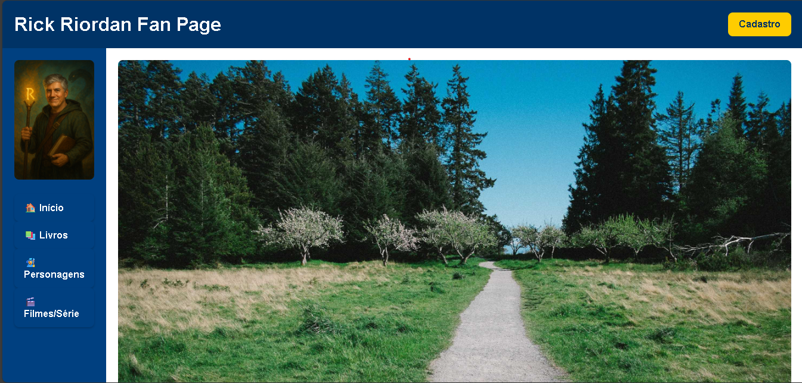
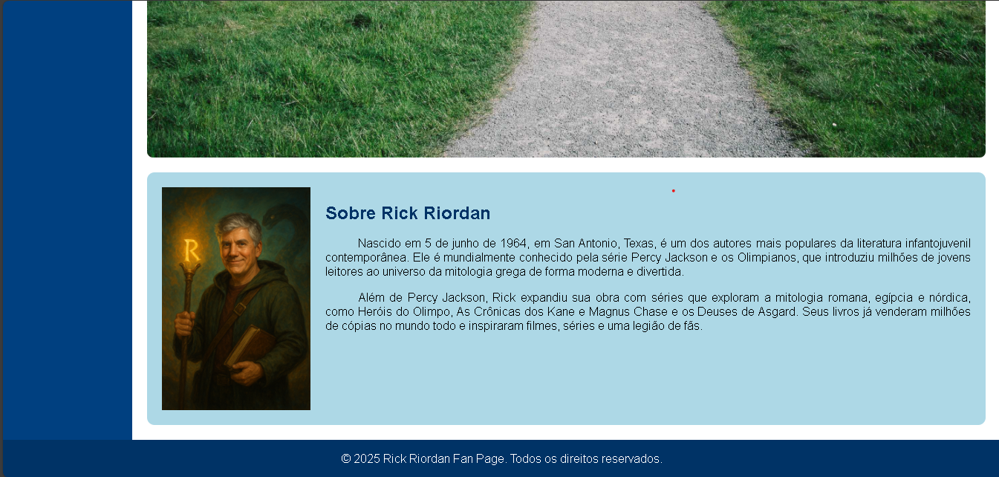
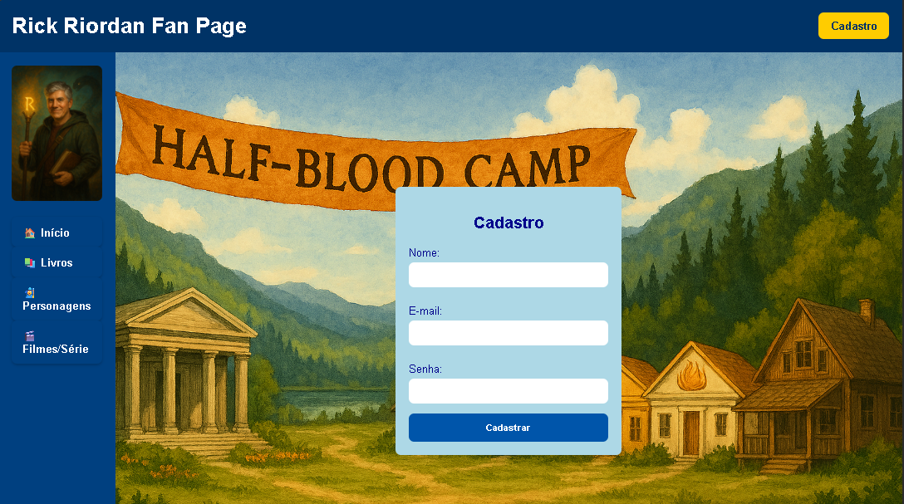
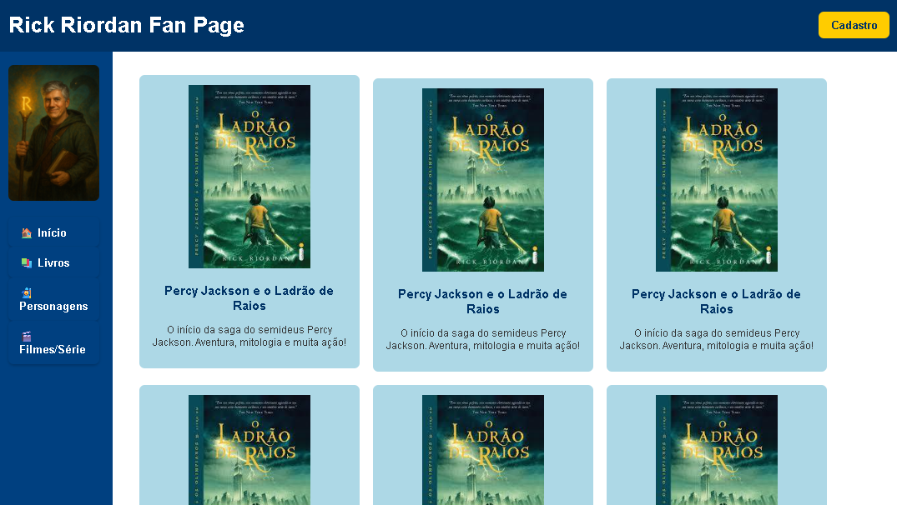

# Trabalho Prático - Semana 03

Dessa vez, vamos escolher uma proposta de projeto para trabalhar.

Nessa atividade, você deverá montar a página inicial do projeto escolhido, a organização do HTML aplicando semântica correta e uso aprimorado do CSS. Leia o enunciado completo no Canvas para mais detalhes.

**IMPORTANTE:** Você deve trabalhar e alterar apenas arquivos dentro da pasta **`public`**. Deixe todos os demais arquivos e pastas desse repositório inalterados. **PRESTE MUITA ATENÇÃO NISSO.**

## Informações Gerais

- Nome: Ana Luísa Faria Gomes
- Matricula: 899314
- Proposta de projeto escolhida: 1. Pessoas e Produções
- Breve descrição sobre seu projeto: 
Este projeto é uma fan page dedicada ao autor Rick Riordan, criada a partir da proposta “Pessoas e Produções”, em que a entidade principal é o autor e a entidade secundária são suas obras literárias.

A aplicação foi desenvolvida em HTML e CSS, utilizando tags semânticas e estilização responsiva. A página inicial apresenta informações biográficas, além de seções para livros, personagens e adaptações, oferecendo uma navegação simples e organizada.

## Print do(s) wireframe(s) criado

## Print da home-page criada

